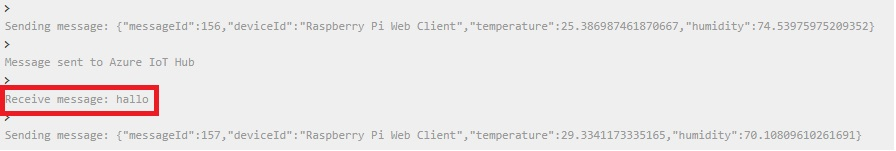

# IoT Raspberry Pi Testing

Here I show how to monitor device-to-cloud messages and send cloud-to-device messages between your IoT device and Azure IoT Hub.

From VS code: 

From the RPI-simulator output:

